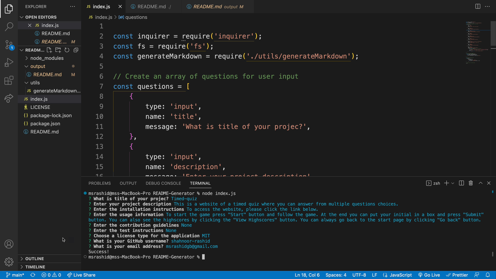

# README-Generator

## Description

This is an app to generate README file..

## Table of Contents 

Please see below.
- [Installation](#installation)
- [Usage](#usage)
- [Credits](#credits)
- [Screenshot](#Screenshot)
- [video](#Video)
- [License](#license)

## Installation

Install nodejs, npm and open index.js.
()

## Usage

To start the app log in to your terminal and open node index.js, and follow the instructions.

## Credits

Tutorial : 
www.w3schools.com 
www.javascript.info 
www.youtube.com 
www.stackoverflow.com

## Screenshots

## Video

## License

[MIT](https://choosealicense.com/licenses/mit/)
